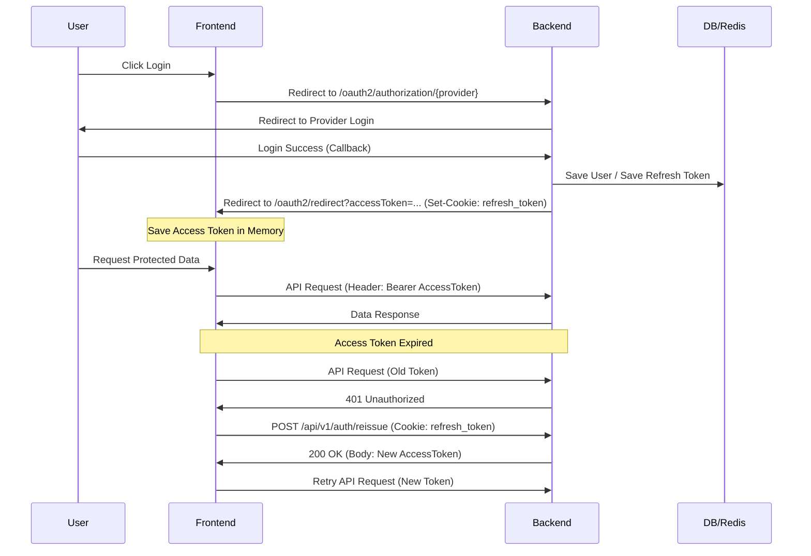

# Frontend-Backend Authentication Integration Guide

This document explains how the Frontend (React/Next.js) integrates with the Backend (Spring Boot) OAuth2 authentication system.

## 1. Login Flow (Social Login)

The login process is initiated by the Frontend but handled primarily by the Backend via browser redirects.

1.  **User Clicks Login Button**:
    -   Frontend redirects the user's browser to the Backend's OAuth2 authorization endpoint.
    -   **URL**: `http://localhost:8080/oauth2/authorization/{provider}`
    -   **Providers**: `google`, `kakao`, `naver`
    -   *Example*: `<a href="http://localhost:8080/oauth2/authorization/google">Login with Google</a>`

2.  **Social Provider Auth**:
    -   User logs in with their social account (Google/Kakao/Naver).
    -   Provider redirects back to Backend.

3.  **Backend Processing**:
    -   Backend verifies the code, gets user info, and creates/updates the `User` entity.
    -   Backend generates `Access Token` and `Refresh Token`.
    -   **Refresh Token** is baked into an `HttpOnly Cookie`.

4.  **Redirect to Frontend**:
    -   Backend redirects the browser to the Frontend's redirect handler page.
    -   **URL**: `http://localhost:3000/oauth2/redirect?accessToken={ACCESS_TOKEN}`
    -   *Note*: The `refreshToken` is **NOT** in the URL; it is in the `Set-Cookie` header.

5.  **Frontend Handling**:
    -   Frontend extracts `accessToken` from the URL query parameters.
    -   **Action**: Save `accessToken` in memory (e.g., React Context, Redux, or a variable). **Do NOT save in LocalStorage** for better security (XSS protection).
    -   Frontend clears the URL history to hide the token.

## 2. Token Storage Strategy

| Token Type | Storage Location | Security Properties |
| :--- | :--- | :--- |
| **Access Token** | **Memory** (Variable) | Vulnerable to XSS if in LocalStorage. Safe in memory (cleared on refresh). |
| **Refresh Token** | **HttpOnly Cookie** | **Secure**. Inaccessible to JavaScript (XSS safe). Sent automatically by browser. |

## 3. Making API Requests

When making requests to protected API endpoints:

1.  Frontend adds the `Authorization` header.
2.  **Format**: `Authorization: Bearer {ACCESS_TOKEN}`
3.  **Cookie**: The browser **automatically** includes the `refresh_token` cookie in the request (if `credentials: 'include'` is set in fetch/axios).

```javascript
// Example (Axios)
axios.get('http://localhost:8080/api/v1/users/me', {
  headers: {
    Authorization: `Bearer ${accessToken}`
  },
  withCredentials: true // Important for Cookies
});
```

## 4. Token Refresh Flow (Silent Refresh)

Since the Access Token is short-lived (e.g., 30 mins) and stored in memory (lost on refresh), you need a mechanism to get a new one.

### Scenario A: Page Refresh / App Init
When the user refreshes the page, the Access Token in memory is lost.
1.  App initializes.
2.  Check if Access Token exists (it won't).
3.  Call `/api/v1/auth/reissue` endpoint immediately.
    -   **Request**: `POST /api/v1/auth/reissue` (No body needed, Cookie sent automatically).
    -   **Response**: New `accessToken` in JSON body.
4.  Save new `accessToken` to memory.

### Scenario B: Token Expiration (401 Error)
When an API request fails with `401 Unauthorized`:
1.  **Interceptor** catches the 401 error.
2.  Call `/api/v1/auth/reissue`.
3.  **If Success**:
    -   Get new `accessToken`.
    -   Retry the original failed request with the new token.
4.  **If Failure** (Refresh Token expired/invalid):
    -   Redirect user to Login Page.

## 5. Logout Flow

1.  **User Clicks Logout**:
2.  Frontend calls Backend Logout API.
    -   **Request**: `POST /api/v1/auth/logout`
    -   **Headers**: `Authorization: Bearer {accessToken}`
    -   **Cookie**: Sent automatically.
3.  **Backend Action**:
    -   Deletes Refresh Token from Redis.
    -   Clears the `refresh_token` cookie (Max-Age: 0).
4.  **Frontend Action**:
    -   Clear `accessToken` from memory.
    -   Redirect to Home/Login page.

## Summary Diagram


